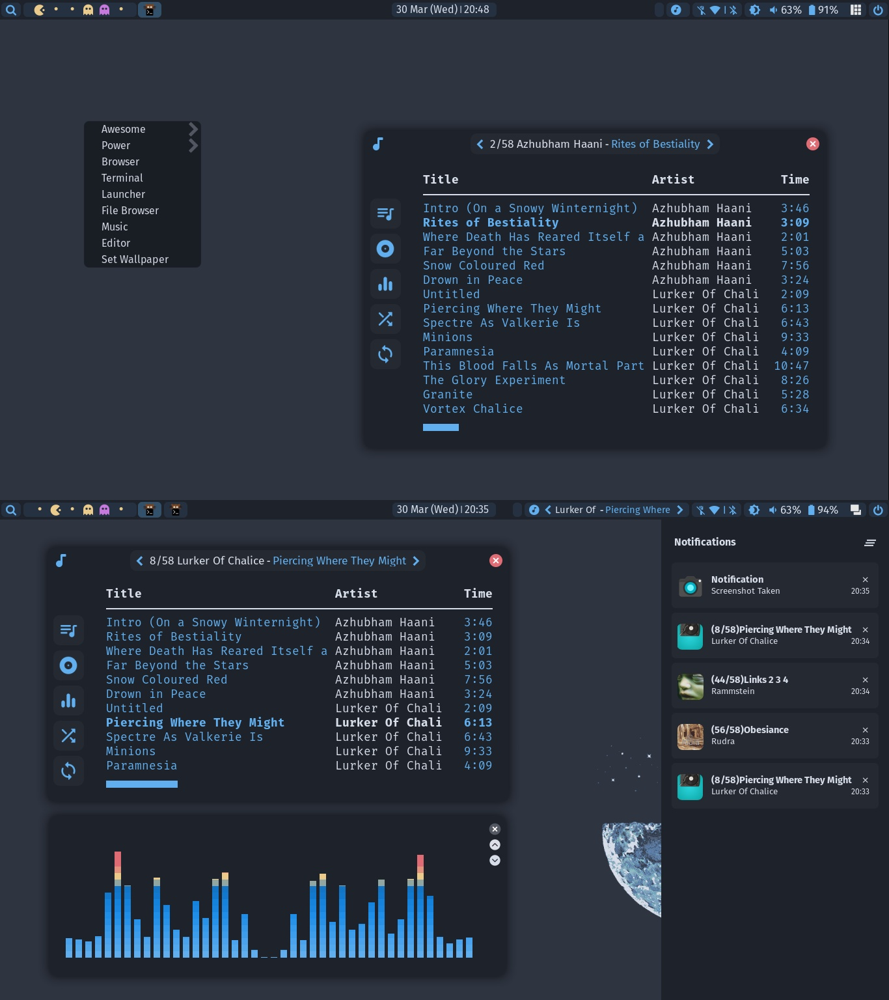

## awesome
<div align="center">
    
</div>

<br>

<p align="center">
	
</p>

### Welcome and Thanks for dropping by!
This are my personal configurations of AwesomeWM.

I use OneDark colorscheme for everything.

When it comes to functionality and customization awesome comes really close to full-fledge desktop environment.
Awesome can do everything I need from desktop with minimum dependencies and system resources.

Apart from awesome window manager I use following programs.

|            | Programs           |
| ---------- | ------------------ |
| Terminal   | st, kitty          |
| Shell      | mksh, dash         |
| Editor     | neovim             |

<br>

## Setup

- Install Dependencies
  ```shell
  yay -Sy awesome-git pulseaudio pamixer mpc mpd ncmpcpp playerctl xorg-xbacklight \
  xdotool --needed
  ```
- Clone this repository

   Move your old configurations to separate location and copy configs to your ~/.config

    ```shell
   git clone  https://github.com/niraj998/awesome.git
   cd awesome
   [ -d "$HOME/.config/awesome" ] && mv $HOME/.config/awesome $HOME/.config/Bkpawesome
   [ -d "$HOME/.config/ncmpcpp" ] && mv $HOME/.config/ncmpcpp $HOME/.config/Bkpncmpcpp
   cd config
   cp -r awesome $HOME/.config/
   cp -r ncmpcpp $HOME/.config/
  ```
- Install all fonts from fonts folder
    ```shell
    cd ..
    cp -r fonts $HOME/.local/share/fonts
    fc-cache -fv
    ```
- Lastly

  Check out rc.lua file it contains documentation of awesome my config files. And go to config folder inside awesome and select your system specific programs.

  I've added xresources file if you want to change terminal colors to match with the rest of the setup you can use that (Optional)


## Credits to
  [elenapan's dotfiles for some part of configurations](https://github.com/elenapan/dotfiles)
